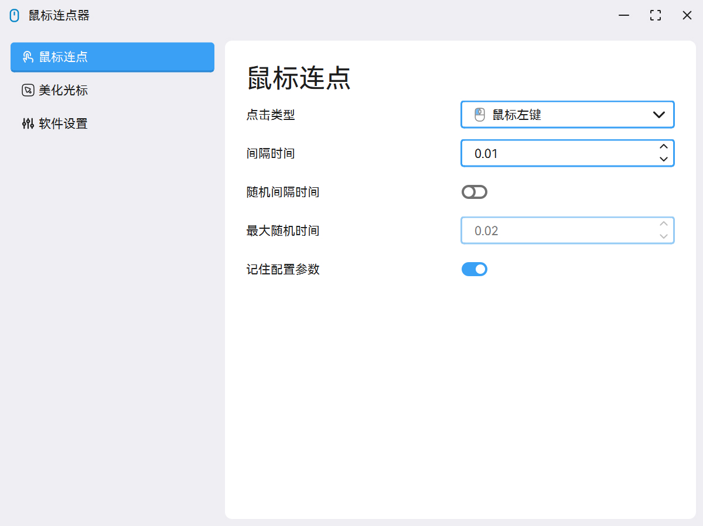
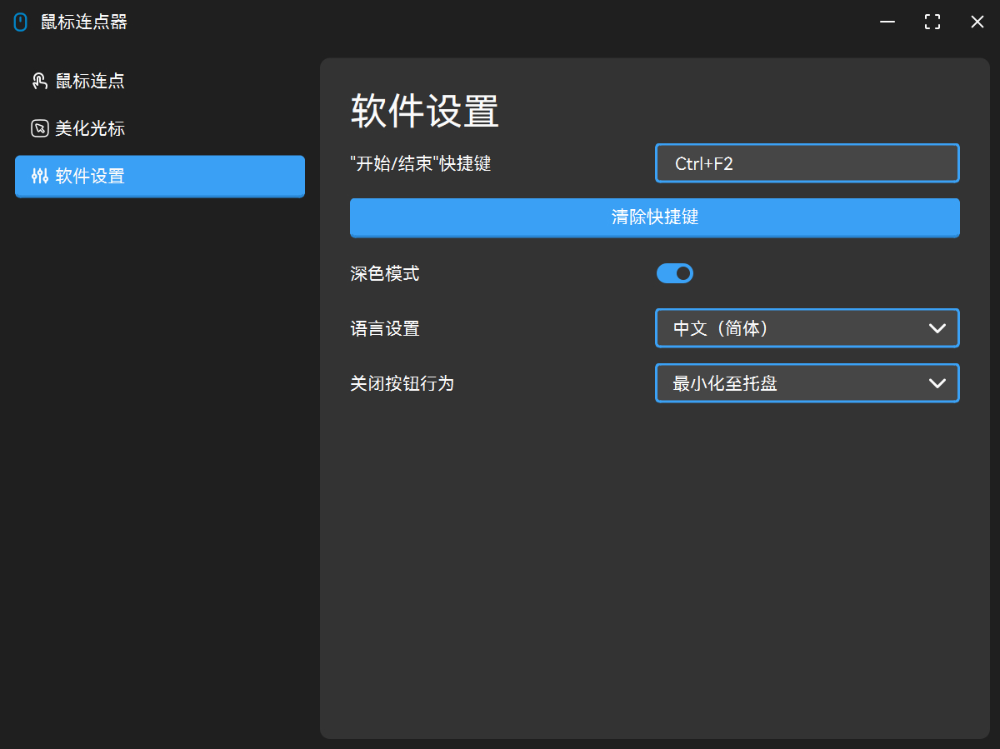
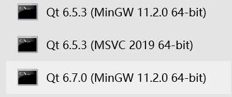

## 🐀 MouseClick

这是我学习编程以来的**第一个 GitHub 项目仓库**，对我个人而言算是一个全新的起点，但项目本身远未结束！

新版本使用 Qt6 Widget 进行了完全重构，并基于 QSS 实现了相对美观的 UI 界面，设计风格主要参考了 [**Fluent2 Design**](https://fluent2.microsoft.design/) 的标准。

下面是软件的运行截图：

|**浅色模式**|**深色模式**|
|:-:|:-:|
|||

**注意**：软件新增了美化光标的功能，其中所有光标资源**均非本人制作**，而是基于网络资源进行修改以适应软件使用标准（每份光标资源**均已注明出处**，并提供双击跳转官网的功能）。

## 👒 自定义光标资源

我们欢迎并鼓励您为本项目贡献更多光标主题！您可以通过**提交 Pull Request（PR）**或**直接创建 Issue** 来分享您的资源。但请注意，***本项目严格遵循开源精神，尊重每一位创作者的劳动成果***，因此所有提交的光标资源都将经过认真审核。

### 📁 资源目录结构

所有光标主题文件夹必须放置在 `assets/cursors` 目录下，推荐参考以下结构：

```text
assets
\---cursors
    +---a0x Cursors
        +---config.json      # 配置文件（必须存在）
        +---logo.png         # 软件中显示的预览图（强烈建议提供）
        +---xxx.ani / yyy.cur
        \--- ...
    +---Anya Forger
    +---Deep Blue Fusion
    +---Helltaker Stroke Version
    +---[Dark]Win11 Concept Cursor Classic
    +---[Light]Win11 Concept Cursor Classic
    +---小黑猫
    +---摸鱼猫
    \--- ...
```

### 📄 配置文件规范

每个主题目录下必须包含一个 `config.json` 文件，其格式如下：

```json
{
    "name": "光标主题名称（建议与文件夹名一致）",
    "cursor": {
        "AppStarting": "working.ani（必须放在主题根目录）",
        "Arrow": "arrow.ani（不推荐使用中文文件名）",
        "Crosshair": "precision.ani",
        "Hand": "link.ani",
        "Help": "helpsel.ani",
        "IBeam": "text.ani",
        "No": "unavailable.ani",
        "NWPen": "handwrite.ani",
        "Person": "person.ani",
        "Pin": "position.ani",
        "SizeAll": "move.ani",
        "SizeNESW": "nesw.ani",
        "SizeNS": "ns.ani",
        "SizeNWSE": "nwse.ani",
        "SizeWE": "ew.ani",
        "UpArrow": "alternate.ani",
        "Wait": "busy.ani"
    },
    "author": "平台@作者",
    "source": "https://www.seaepoch.com/"
}
```

### ⚠️ 审核标准

所有资源文件（*.ani / *.cur）必须放置在主题根目录下，路径引用需与 `config.json` 中保持一致。

配置文件必须完整包含 `name`、`cursor`、`author`、`source` 四个字段，且字段值符合规范。

建议提供 logo.png（尺寸推荐保持在 256x256 以下）以在软件中展示主题预览。

文件名请避免使用特殊字符或中文，以免引起跨平台兼容性问题。

如有任意项不符合上述要求，我们可能无法接受您的 PR，敬请谅解。

## ⚙ 环境要求

|Component|Requirement|
|:--|:--|
|Compiler|>= C++17|
|CMake|>= 3.19|
|Qt|>= 6.7.0 ?|

## 🧤 编译项目

1. 首先克隆本项目：
   ```cmd
   git clone git@github.com:SeaEpoch/MouseClick.git
   ```
2. 使用您常用的编译方式（如 Qt Creator 或命令行）直接编译项目即可。

## 🛒 打包项目

1. 进入编译输出目录 `/MouseClick/build/Desktop_Qt_x_x_x_xxxxx_xxx_bit-Release/dist`，该目录下的所有文件即为打包所需的全部内容（需先完成编译才能看到）。
2. 打开与您编译时所用编译器版本**一致**的 **Qt 命令行工具**（如下图所示），并通过 `cd` 命令切换到上述 `dist` 目录。
   
3. 执行命令 `windeployqt.exe ./MouseClick.exe`，等待命令执行完毕即可完成打包。

## Star History

[](https://www.star-history.com/?repos=SeaEpoch%2FMouseClick&type=timeline&legend=top-left)

## 📄 开源证书

MouseClick（本项目）遵守 [GPL-3.0 license](https://github.com/SeaEpoch/MouseClick?tab=GPL-3.0-1-ov-file) 开源证书。
